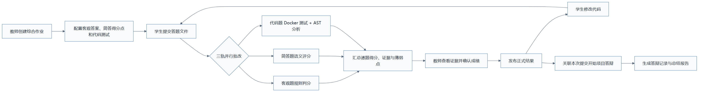
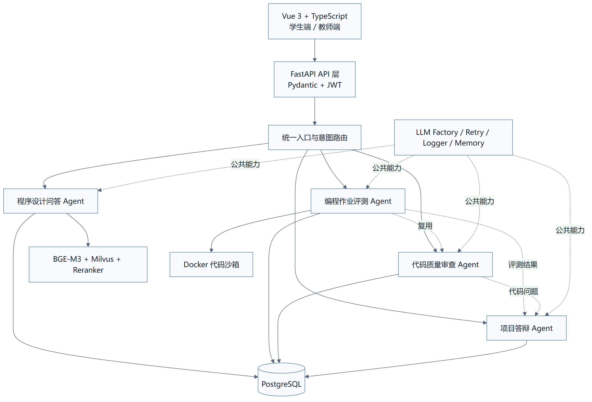

<div align="center">

# CodeMentor Agent

### 程序设计课程智能实训与评测平台

从“答疑”延伸到“综合作业、代码运行、质量审查、教师复核与答辩”的多 Agent 课程实训系统。


</div>

---

## 项目简介

CodeMentor Agent 面向程序设计课程中的四类核心问题：课程答疑不及时、代码作业批改量大、代码质量缺少系统反馈，以及学生提交项目后难以验证真实理解。

平台将业务拆分为四个职责明确的 Agent，并使用结构化数据把它们连接起来：

- **程序设计问答 Agent**：基于教师课程资料完成 RAG 问答，返回可追溯来源。
- **综合作业批改 Agent**：客观题、简答题和代码题三轨并行；代码题额外执行 Docker 测试与 AST/规则分析。
- **代码质量审查 Agent**：通过 AST、确定性规则和可选的大模型评审输出六维代码报告。
- **项目答辩 Agent**：关联学生真实提交、测试结果和代码问题，按五个阶段持续追问。

系统不会让模型直接发布正式成绩。自动评测只生成建议分和证据，最终结果由教师确认。

## 核心业务流程



> 核心原则：确定的事情交给规则，不确定的事情交给模型，高风险的事情交给人工确认。

## 四个 Agent 的职责边界

| Agent | 主要输入 | 核心流程 | 主要输出 |
|---|---|---|---|
| 程序设计问答 | 学生问题、课程编号、会话历史 | 问题分类 → 混合召回 → 精排 → 置信度路由 | 回答、引用来源、会话记忆 |
| 综合作业批改 | 作业题目、得分点、代码测试、学生答案 | 客观/简答/代码三轨并行 → 汇总 → 教师复核 | 逐题证据、建议分、最终成绩 |
| 代码质量审查 | 上传代码或已有提交 | AST 与本地规则 → 六维评审 → 问题去重排序 | 维度分、问题行号、严重程度、修改建议 |
| 项目答辩 | 作业提交、测试结果、审查报告 | 五阶段状态机 → 连续追问 → 条件结束 | 会话记录、答辩总结、待评价状态 |

### 作业评测与代码审查为什么不是重复功能？

- **综合作业批改回答“这次课程作业如何判定”**：客观题规则判分、简答题按得分点评审、代码题真实运行，并进入教师成绩确认流程。
- **代码审查回答“这份代码写得怎么样”**：可以独立分析代码，重点解释复杂度、规范、维护性、健壮性和安全问题。
- 作业评测会复用代码质量分析能力，但只消费其评分和薄弱点；独立审查页面则提供完整问题报告。

## 技术架构



## 关键实现

### 1. 课程 RAG 问答

- MiniLM 负责高频问题分类。
- BGE-M3 同时生成 Dense 与 Sparse 表示，在 Milvus 中按 `0.7 / 0.3` 融合召回。
- BGE-Reranker 将 Top10 候选精排为 Top3。
- 最高相关度达到 `0.75` 时基于课程资料回答，否则进入明确的兜底路径。
- 知识块保存课程、租户、文档和位置元数据，回答可返回来源。

### 2. Docker 代码沙箱

学生代码不会直接在 Web 服务进程中执行。当前原型使用一次性 Docker 容器，并设置：

- 禁用网络；
- 根文件系统只读；
- 源代码只读挂载；
- `256 MB` 内存、`0.5 CPU`、`64 PIDs`；
- 单次执行默认最长 `5 秒`；
- 删除 Linux capabilities，并启用 `no-new-privileges`。

### 3. 六维代码审查

代码审查覆盖正确性、算法与复杂度、可读性与规范、模块化与可维护性、异常处理与健壮性、安全性六个维度。Python 代码优先使用 AST 和确定性规则建立基线；配置模型后，可增加结构化语义评审。单个维度失败时只降级该维度，不阻断整份报告。

### 4. 五阶段项目答辩

答辩过程分为项目概述、设计思路、调试分析、优化改进和总结复盘。系统显式保存阶段与轮次，并加载本次作业要求、测试结果、薄弱点和审查问题作为上下文，避免生成与学生代码无关的通用问题。

## 项目结构

```text
backend/
├─ agents/
│  ├─ qa/                 # 程序设计知识问答 Agent
│  ├─ exam/               # 综合作业三轨批改 Agent
│  ├─ assignment/         # 编程专项实训 Agent
│  ├─ code_review/        # 六维代码审查 Agent
│  └─ defense/            # 项目答辩 Agent
├─ api/v1/                # FastAPI 业务接口
├─ core/                  # 模型工厂、记忆、重试与代码沙箱
└─ db/                    # 数据库迁移

frontend/src/
├─ views/assignment/      # 学生作业提交与结果
├─ views/code-review/     # 代码审查与报告
├─ views/defense/         # 项目答辩
└─ views/teacher/         # 教师课程管理与成绩确认

scripts/
├─ init_db.sql            # 数据库结构
├─ seed_data.py           # 本地演示账号
├─ seed_coding_course.py  # 示例课程、作业与测试用例
└─ verify_codementor.py   # 核心能力自检
```

## 快速启动

### 1. 环境要求

- Python 3.11
- Node.js 18+
- Docker Desktop
- Conda（推荐）

> GitHub 仓库不包含多 GB 的本地模型权重。请将 BGE-M3、BGE-Reranker 和 MiniLM 模型放到本地目录，并在 `.env.local` 中配置对应路径。

### 2. 创建 Python 环境

```powershell
conda env create -f environment.yml
conda activate edu_agent
```

### 3. 配置环境变量

```powershell
Copy-Item .env.example .env.local
```

修改 `.env.local` 中的数据库、MinIO、JWT 和本地模型路径。`DEEPSEEK_API_KEY` 可以暂时留空；无密钥时 Docker 测试、本地代码分析、教师确认和固定阶段答辩仍可运行。

### 4. 启动基础设施并初始化数据

```powershell
docker compose --env-file .env.local up -d
python -c "import asyncio; from backend.db.migrations import run_migrations; asyncio.run(run_migrations())"
python scripts/seed_data.py
python scripts/seed_coding_course.py
python scripts/seed_standard_exam.py
python scripts/verify_codementor.py
python scripts/verify_mixed_assignment.py
```

### 5. 启动后端

```powershell
python -m uvicorn backend.main:app --host 127.0.0.1 --port 8000
```

### 6. 启动前端

```powershell
Set-Location frontend
npm install
npm run dev
```

| 服务 | 地址 |
|---|---|
| 前端页面 | `http://127.0.0.1:5173` |
| API 文档 | `http://127.0.0.1:8000/docs` |
| 健康检查 | `http://127.0.0.1:8000/health` |
| Attu | `http://127.0.0.1:30000` |

## 当前验证情况

- Python 模块编译检查通过。
- Vue 3 前端生产构建通过。
- 综合作业客观题规则轨、无密钥简答题复核降级、代码题 3 个 Docker 用例与 AST 六维分析已跑通。
- 自动建议分、教师复核、成绩发布与项目答辩链路已验证。
- 无模型密钥时，本地代码审查与沙箱测试仍可执行。

## 数据与工程边界

- 仓库中的课程、作业和测试用例由初始化脚本生成，仅用于演示流程，不代表真实学校数据。
- 测试通过只证明代码通过当前用例，不能证明程序对所有输入都正确。
- 模型评价属于辅助建议，不替代教师的正式判断。
- 当前 Docker 配置面向本地课程原型；公网环境需要独立沙箱 Worker、持久化任务队列、系统调用隔离、监控和限流。
- `.env.local`、本地模型、数据库、运行日志、学生提交和前端构建产物均不会提交到仓库。

## 后续计划

- [ ] 将后台评测迁移到持久化任务队列。
- [ ] 将代码执行拆分为独立沙箱 Worker。
- [ ] 使用 PostgreSQL Checkpointer 保存可恢复的 Agent 状态。
- [ ] 建立教师标注的 RAG、代码评分和答辩评测集。
- [ ] 增加链路追踪、Token 消耗和沙箱任务监控。

---

<div align="center">
用于个人学习、工程实践与技术面试展示。
</div>
