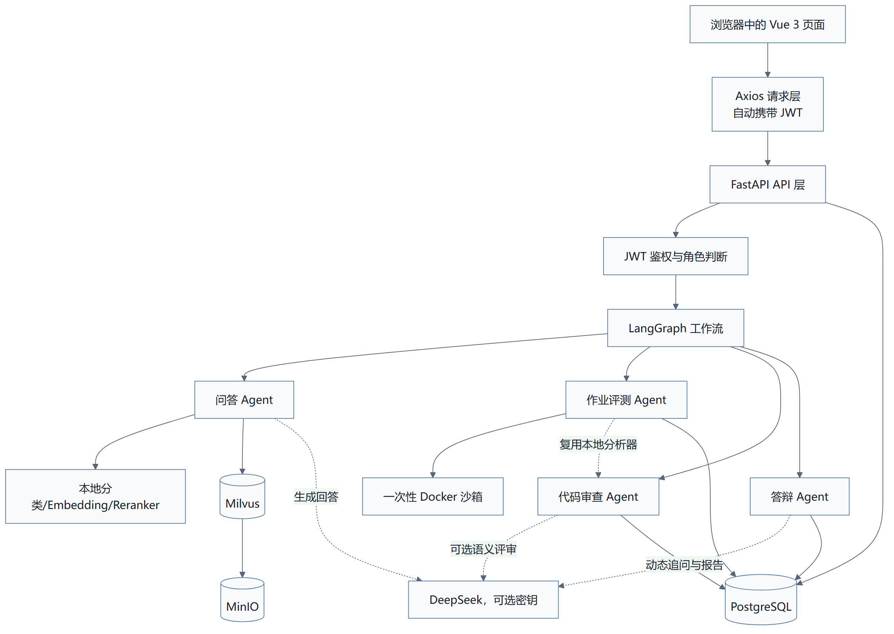
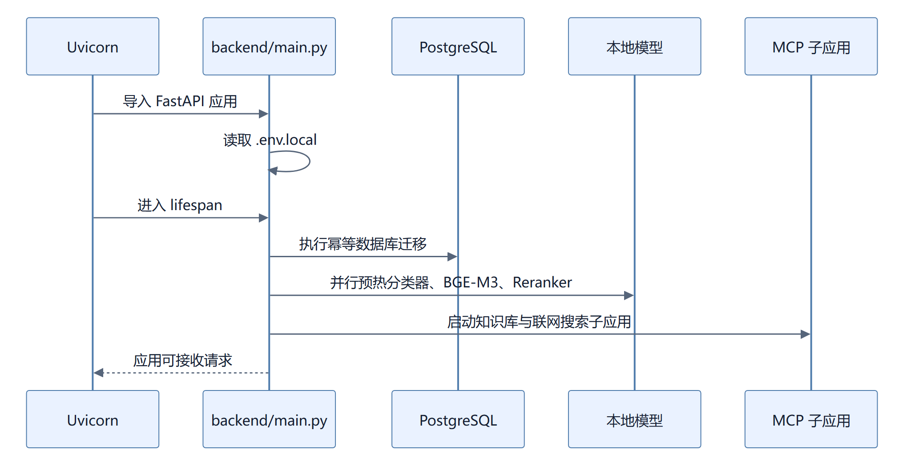
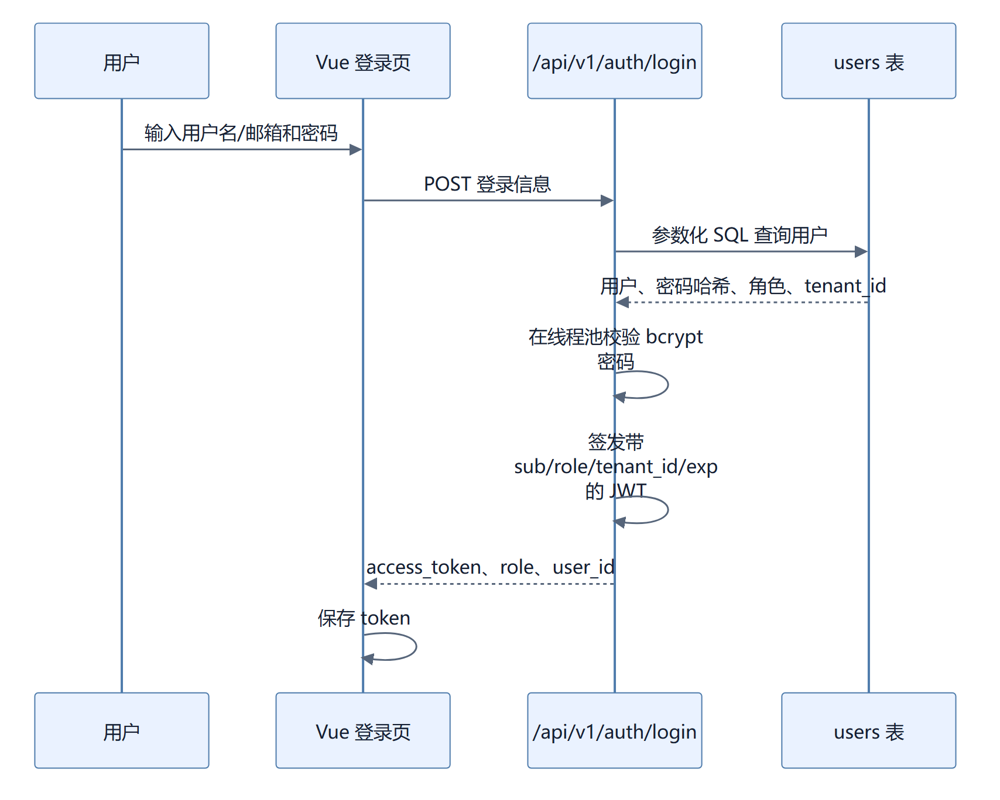
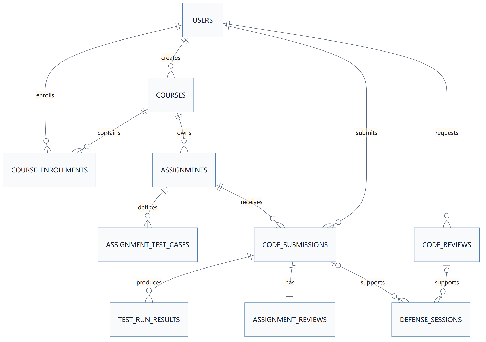
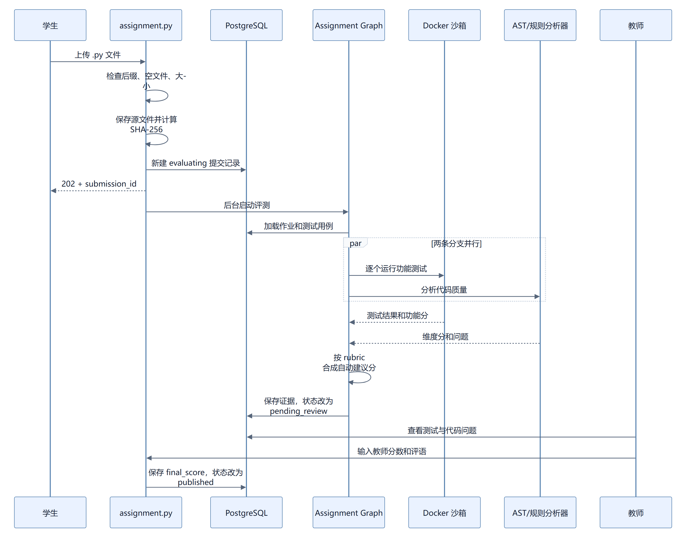
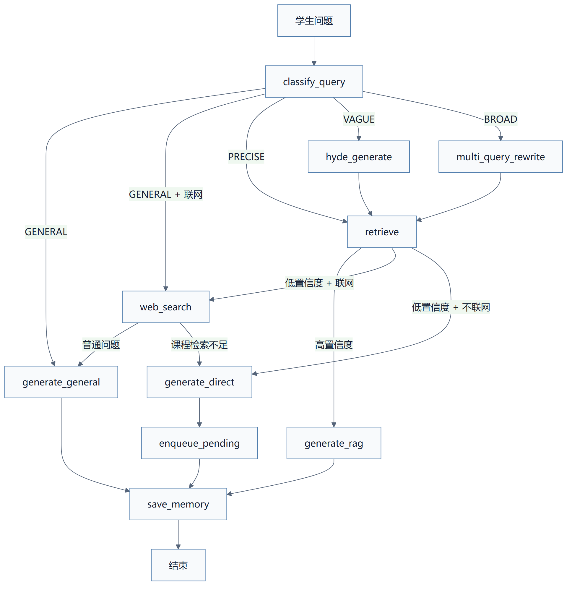

# CodeMentor Agent 代码阅读与运行指南

> 适用项目：程序设计课程智能实训与评测平台（CodeMentor Agent）  
> 文档目标：不要求你先看懂所有源码，而是先建立“页面—接口—Agent—数据库—结果”的完整心智模型，再按业务链路逐步读代码。  
> 说明：本文完全依据当前仓库代码整理。演示账号、课程、作业和测试用例来自本地初始化脚本，不代表真实学校数据。

---

## 1. 先用一句话理解项目

CodeMentor 是一个面向程序设计课程的教学平台。教师负责创建课程、作业和测试用例；学生上传 Python 代码后，系统一边用 Docker 运行测试用例，一边用 Python AST 和确定性规则分析代码质量，然后生成自动建议分；教师查看证据后确认正式成绩。学生还可以单独进行六维代码审查，并基于真实提交或审查记录进行项目答辩。

项目最重要的设计原则是：

- 能确定的事实交给程序和规则，例如测试是否通过、是否出现裸 `except`、是否使用 `eval()`。
- 需要语义理解的内容可以交给大模型，例如职责划分是否合理、如何给出针对性的改进建议。
- 影响正式成绩的高风险决策交给教师，模型和规则只产生建议与证据。

---

## 2. 当前项目到底包含什么

### 2.1 当前主业务中的四个 Agent

| Agent | 它回答的问题 | 是否运行代码 | 是否依赖大模型 | 是否经过教师确认 |
|---|---|---:|---:|---:|
| 程序设计问答 Agent | “课程资料里怎么解释这个知识点？” | 否 | 是；同时依赖本地检索模型 | 不涉及成绩 |
| 作业批改 Agent | “客观题、简答题、代码题分别应得多少分？” | 代码题放进 Docker | 简答题可调用；代码题不调用 | 是，所有综合作业最终都由教师确认 |
| 代码质量审查 Agent | “这份代码写得怎么样，应该如何改？” | 否 | 可选；无密钥时使用本地规则 | 当前独立审查没有教师复核流程 |
| 项目答辩 Agent | “学生是否真正理解自己的设计和问题？” | 否 | 有密钥时动态评价；无密钥时固定阶段追问 | 无密钥时报告等待教师评价 |

### 2.2 当前主入口已接入的模块

后端总路由位于 `backend/api/router.py`，目前正式接入：

```text
/api/v1/auth           JWT 登录与当前用户
/api/v1/chat           统一 AI 助手入口
/api/v1/qa             程序设计问答
/api/v1/assignments    课程、作业、提交、评测与教师确认
/api/v1/mixed-assignments 综合作业三轨批改与教师逐题确认
/api/v1/code-review    独立代码审查
/api/v1/defense        项目答辩
```

早期 EduAgent 中与当前主题无关的简历审查、求职模拟面试及其前后端代码已经清理。原 `exam` 目录保留，是因为它承载了客观题、简答题和代码题三轨批改，现在通过 `/api/v1/mixed-assignments` 作为 CodeMentor 的综合作业模块重新接入。

---

## 3. 先看整体架构



### 各组件的职责

- Vue 3：展示学生端、教师端页面，收集文件和表单。
- Axios：统一请求后端，在请求头中注入 JWT。
- FastAPI：负责参数校验、权限判断、文件接收、接口响应。
- LangGraph：把一个复杂任务拆成多个节点，并规定执行顺序、并行关系和条件路由。
- PostgreSQL：保存用户、课程、作业、测试用例、提交、评分、审查和答辩记录。
- Docker：隔离运行学生 Python 代码，不让代码直接运行在后端进程中。
- Python AST：把 Python 源码解析成语法树，确定性识别代码结构和部分风险。
- Milvus：保存课程资料的向量，用于 RAG 召回。
- MinIO：作为 Milvus 的对象存储依赖，不直接承载业务页面上传的作业代码。
- DeepSeek：用于问答生成、独立代码审查的语义判断和答辩动态评价；当前密钥为空时相关能力会降级。

---

## 4. 推荐阅读顺序

不要从几百行的 Agent 节点直接开始。建议按下面顺序阅读：

1. `README.md`：先知道产品要解决什么问题。
2. `backend/config.py`：知道运行依赖和配置从哪里来。
3. `backend/main.py`：知道后端启动时做了什么。
4. `backend/dependencies.py`：理解数据库会话和 JWT 鉴权。
5. `backend/api/router.py`：确认当前真正接入了哪些业务。
6. `frontend/src/router/index.ts` 与 `frontend/src/components/layout/Sidebar.vue`：对应前端页面入口。
7. 选择一条业务链，按“前端 API → 后端 API → graph.py → nodes.py → 数据表”阅读。
8. 最后再读 `backend/core/orchestrator.py` 和统一聊天入口，理解不同 Agent 如何被路由。

一个 Agent 目录通常有四类文件：

```text
state.py    定义工作流运行期间共享的数据
graph.py    定义节点、边、并行和条件分支
nodes.py    每个节点的实际业务逻辑
prompts.py  大模型提示词、评分维度或兜底问题
```

理解 LangGraph 时可以把它想成一条“有状态的业务流水线”：`state.py` 是流转单，`graph.py` 是流程图，`nodes.py` 是每个工位。

---

## 5. 后端如何启动

入口文件是 `backend/main.py`。执行 Uvicorn 后，主要经历以下步骤：



关键点：

- 配置由 `backend/config.py` 中的 `Settings` 统一读取。
- 数据库迁移失败或本地模型预热失败时，代码会记录警告但尽量不阻塞整个服务启动。
- `backend/db/migrations.py` 中只使用幂等 DDL，例如 `CREATE TABLE IF NOT EXISTS`，避免重复启动破坏数据。
- MCP 子应用分别挂载在 `/mcp/kb` 与 `/mcp/web-search`。
- `/health` 只证明 FastAPI 进程存活，不等于每个大模型接口都可用。

---

## 6. JWT 登录、角色和多租户

### 6.1 登录流程



之后 `frontend/src/api/client.ts` 的请求拦截器把 Token 放入：

```text
Authorization: Bearer <token>
```

后端 `get_current_user()` 验证签名和过期时间，并向接口提供：

```python
{
    "user_id": "...",
    "role": "student | teacher | admin",
    "tenant_id": "tenant_default"
}
```

### 6.2 权限边界

- 学生只能查看自己的提交、代码审查和答辩记录。
- 教师和管理员可以创建课程、作业、测试用例并确认成绩。
- 教师端前端路由有导航守卫，但真正的权限仍由后端检查；只隐藏菜单不等于安全。
- 业务查询普遍带 `tenant_id` 条件，用于隔离不同租户的数据。

---

## 7. 数据库怎么串起整个项目

核心数据关系如下：



最关键的表：

- `users`：用户、角色、租户、密码哈希。
- `courses`：课程基本信息。
- `course_enrollments`：学生和课程的关系。
- `assignments`：作业要求、语言、评分权重、满分。
- `assignment_test_cases`：编程专项实训的输入、期望输出、权重、是否隐藏、超时时间。
- `exams/questions/scoring_points`：综合作业、五类题目和简答题得分点。
- `question_test_cases`：综合作业中每道代码题自己的 Docker 测试用例。
- `exam_submissions/exam_reviews`：综合作业提交和逐题自动/教师评分证据。
- `code_submissions`：学生上传文件、SHA-256、评测状态和最终成绩。
- `test_run_results`：每个用例的通过状态、耗时、输出和错误。
- `assignment_reviews`：功能分、质量分、自动建议分、问题和教师意见。
- `code_reviews`：独立六维代码审查结果。
- `defense_sessions`：答辩阶段、轮次、消息、报告和得分。

### 7.1 为什么既有 `code_submissions` 又有 `assignment_reviews`

`code_submissions` 表示“一次提交本身”，负责文件、学生、状态和最终成绩；`assignment_reviews` 表示“机器对此次提交的分析”，负责功能分、质量分、维度问题和反馈。这样教师以后修改最终成绩时，不会覆盖机器原始证据。

### 7.2 状态是怎样变化的

作业提交状态：

```text
evaluating → pending_review → published
     └──────────────→ failed
```

独立代码审查状态：

```text
processing → done
     └────→ failed
```

答辩状态：

```text
in_progress → finished
```

---

## 综合作业三轨批改（当前主作业流程）

综合作业沿用原 EduAgent 的三轨并行结构，但第三轨已从“让大模型直接看代码评分”改为可复现的 Docker 与 AST 评测。

```text
解析 Word 答题文件 → 从数据库加载题目、得分点和代码测试
                         ↓
        ┌────────────────┼────────────────┐
        ↓                ↓                ↓
客观题规则轨       简答题语义轨       代码工程评测轨
答案标准化比对     按教师得分点评分    Docker 测试 + AST/规则
        └────────────────┼────────────────┘
                         ↓
               汇总逐题结果与薄弱点
                         ↓
               LangGraph interrupt 暂停
                         ↓
            教师逐题确认或修改后发布
```

关键代码：

```text
backend/agents/exam/graph.py       三轨批改与教师暂停流程
backend/agents/exam/nodes.py       三条批改轨和结果汇总
backend/api/v1/exam.py             提交、查询、教师确认接口
frontend/src/views/exam/           学生提交与结果页面
frontend/src/views/teacher/ExamReviewView.vue  教师逐题复核
```

三条轨道使用 `asyncio.gather(return_exceptions=True)` 同时启动。一条轨道异常不会抹掉另外两条已经完成的结果。

- 客观题轨：支持单选、多选、判断题。统一大小写、空格和逗号，多选项排序后与教师答案精确比较。
- 简答题轨：根据教师配置的得分点进行结构化语义评分；三题一组并行，置信度低于 0.7 时标记复核。当前没有 DeepSeek 密钥时不会伪造分数，而是直接交教师按得分点批改。
- 代码题轨：每道题读取自己的 `question_test_cases`，多个用例并行放入一次性 Docker；同时用 AST/确定性规则计算质量分。默认按功能 60%、质量 40% 折算为该代码题分数。

代码题结果会保留功能分、质量分、测试通过数、每个测试的耗时和错误、六维质量结果、AST/规则问题与行号。隐藏用例对学生屏蔽输出细节，但教师复核页面可以查看证据。

综合作业接口前缀为 `/api/v1/mixed-assignments`；学生页面为 `/mixed-assignments`，教师确认页面为 `/teacher/mixed-assignment-review`。

演示综合作业由 `scripts/seed_standard_exam.py` 生成，包含单选、多选、判断、简答和“成绩统计器”代码题。核心验证命令：

```powershell
E:\anaconda\envs\edu_agent\python.exe scripts\verify_mixed_assignment.py
```

## 8. 编程专项实训 Agent

相关文件：

```text
frontend/src/views/assignment/
frontend/src/api/assignment.ts
backend/api/v1/assignment.py
backend/agents/assignment/state.py
backend/agents/assignment/graph.py
backend/agents/assignment/nodes.py
backend/core/code_sandbox.py
```

### 8.1 从学生上传到教师发布



### 8.2 为什么上传接口先返回 202

文件上传后，接口把评测注册为 FastAPI `BackgroundTasks`，立即返回 `submission_id`。前端再轮询提交详情。这样 Docker 测试不会让上传请求一直等待。

当前实现适合本地原型，但 `BackgroundTasks` 不具备真正的持久化任务能力：服务进程异常退出时，任务可能丢失。生产环境应改成独立 Worker 和持久化队列。

### 8.3 LangGraph 为什么有两条并行分支

`backend/agents/assignment/graph.py` 定义：

```text
START
  ↓
load_assignment
  ├──────────────→ run_functional_tests ──┐
  └──────────────→ run_quality_review ────┤
                                          ↓
                                      aggregate
                                          ↓
                                      save_review
                                          ↓
                                         END
```

功能测试和代码质量没有数据依赖，因此可以并行执行。两边完成后，LangGraph 才进入 `aggregate` 汇总。

### 8.4 功能分怎么计算

每个测试用例有 `weight`。功能分公式是：

```text
功能分 = 通过用例的权重之和 ÷ 全部用例权重之和 × 100
```

例如三个用例权重都为 1，通过两个：

```text
功能分 = 2 ÷ 3 × 100 ≈ 67
```

系统判断通过的条件是：

1. 进程退出码为 0；
2. 标准输出去掉首尾空白、统一换行符后，与教师的期望输出完全相等。

它不是模糊匹配。因此多输出调试文本、格式不符或小数位不符都会导致测试失败。

### 8.5 Docker 沙箱具体限制了什么

每一个测试用例都会启动一次临时容器，执行完成后用 `--rm` 删除。当前限制包括：

- `--network none`：容器内不能访问互联网或局域网服务。
- `--read-only`：容器根文件系统只读。
- `-v ...:/workspace:ro`：学生源代码目录只读挂载。
- `--tmpfs /tmp:rw,noexec,nosuid,size=64m`：只允许在临时目录写少量数据，且不能从中执行程序。
- `--memory 256m`：内存上限 256 MB。
- `--cpus 0.5`：最多使用约半个 CPU 核心。
- `--pids-limit 64`：限制进程数量，降低 fork 炸弹风险。
- `--cap-drop ALL`：移除 Linux capabilities。
- `no-new-privileges`：禁止通过 setuid 等方式获得更高权限。
- 最长执行时间受用例时间和全局 5 秒上限共同约束。

“禁网”和“只读”不是说学生代码不能读输入，而是：它仍可从标准输入读取教师用例，也可向标准输出打印答案；但不能联网下载内容，也不能修改挂载的项目代码和容器系统文件。

### 8.6 质量分怎么计算

作业评测直接复用 `analyze_code_locally()`，也就是 AST 加确定性规则。它不会调用 DeepSeek。

本地分析器先为六个维度建立 82 分基线，再按命中问题扣分。作业质量分排除“功能正确性”，因为正确性已经由 Docker 测试单独计算，避免重复计分。

```text
作业质量分 = 算法与复杂度、可读性与规范、模块化与可维护性、
             异常处理与健壮性、安全性 这五项的算术平均
```

### 8.7 自动建议分怎么计算

默认 `rubric` 是：

```json
{"functional": 60, "quality": 40}
```

因此：

```text
自动建议分 = 功能分 × 60% + 质量分 × 40%
```

如果 Docker 沙箱不可用，代码不会伪造功能分，而是只按质量部分计算，并强制提示教师复核。

注意：`needs_review` 会在沙箱不可用、存在失败用例或自动分低于 70 时变成 `true`；但保存节点无论如何都会把提交状态改成 `pending_review`。也就是说，当前系统不是“只有异常才由教师看”，而是所有作业都需要教师最终确认，`needs_review` 只是额外风险标记。

### 8.8 隐藏测试用例怎么保护

教师可以把测试用例设为 `is_hidden=true`。学生仍能看到该用例是否通过，但接口会清空隐藏用例的真实标准输出和错误细节，失败时只返回“隐藏测试未通过”。教师端可以看到完整证据。

---

## 9. Python AST 在项目里做了什么

AST 是 Abstract Syntax Tree，即抽象语法树。它把源码从字符串转换成有结构的语法节点。

例如：

```python
def add(a, b):
    return a + b
```

解析后可以理解为“函数定义 → 参数 a、b → 返回语句 → 加法表达式”，而不是只在文本中搜索单词。

当前本地分析器用 AST 完成：

- 验证 Python 语法是否成立，并记录语法错误行。
- 提取类名、函数名、导入模块和 `__main__` 入口。
- 统计函数是否缺少 docstring。
- 判断函数是否超过 50 行。
- 计算 `if/for/while/try/with` 等控制流的最大嵌套深度。
- 检测裸 `except:`。
- 检测列表、字典、集合形式的可变默认参数。

同时使用正则完成跨语言或简单文本特征检查：

- 超过 120 个字符的长行。
- 较多长字符串字面量。
- `eval()`、`exec()`、`os.system()`、`shell=True` 等危险调用。

这里要区分：“函数嵌套很深”和“控制流嵌套很深”不是一回事。当前代码计算的是控制流嵌套，例如多层 `if`、`for` 和 `try`，不是专门统计函数里面再定义函数。

---

## 10. 独立代码质量审查 Agent

相关文件：

```text
frontend/src/views/code-review/
frontend/src/api/codeReview.ts
backend/api/v1/code_review.py
backend/agents/code_review/state.py
backend/agents/code_review/graph.py
backend/agents/code_review/nodes.py
backend/agents/code_review/prompts.py
```

### 10.1 它和作业评测有什么不同

| 对比项 | 作业评测 | 独立代码审查 |
|---|---|---|
| 是否必须关联教师作业 | 是 | 否 |
| 是否真实运行代码 | 是 | 否 |
| 是否使用教师测试用例 | 是 | 否 |
| 是否可上传多种语言 | 当前只收 `.py` | 支持 Python、Java、JS、TS、C、C++、Go |
| AST/本地规则 | 用于质量分 | 用作基线和离线兜底 |
| 大模型 | 当前不调用 | 配置密钥后可参与六维语义评审 |
| 结果用途 | 自动建议分和教师正式成绩 | 改进代码的诊断报告 |
| 教师确认 | 所有提交都要 | 当前没有独立教师复核节点 |

因此，代码审查 Agent 并不多余。作业评测解决“按这份作业标准能得多少分”，代码审查解决“代码在工程质量上哪里需要改”。前者要运行代码，后者重在解释和改进。

### 10.2 六个维度与权重

```text
功能正确性          25%
算法与复杂度        20%
可读性与规范        15%
模块化与可维护性    15%
异常处理与健壮性    15%
安全性              10%
```

综合分是六个维度按权重相加，随后映射为 A/B/C/D/E 等级。

### 10.3 无密钥和有密钥时分别怎样工作

无 DeepSeek 密钥：

```text
上传代码 → AST/正则本地分析 → 六维基线 → 汇总 → 保存
```

有 DeepSeek 密钥：

```text
上传代码 → 本地基线 → 六个维度并行调用 LLM → 每维融合 → 去重排序 → 保存
```

单个维度的融合公式：

```text
维度最终分 = LLM 分数 × 75% + 本地基线分 × 25%
```

本地规则命中的问题不会因模型没有提到就消失；系统会把未重复的规则问题追加回结果。某个维度的模型调用失败时，只回退该维度的本地基线，不阻断整份报告。

当前代码没有实现“AST 与 LLM 冲突检测后自动进入教师审核”。独立审查完成后会直接变为 `done`。面试时应如实描述为“规则证据保留、模型结论作为建议”，不要声称代码里已有未实现的冲突复核流程。

### 10.4 临时文件生命周期

独立审查把上传文件写入系统临时目录，后台审查结束后在 `finally` 中删除临时源文件；结构、分数、问题和摘要会保存到 `code_reviews` 表。

---

## 11. 程序设计问答 Agent

相关文件：

```text
frontend/src/views/qa/QAChatView.vue
frontend/src/api/qa.ts
backend/api/v1/qa.py
backend/agents/qa/state.py
backend/agents/qa/graph.py
backend/agents/qa/nodes.py
backend/core/query_classifier.py
backend/core/knowledge_base.py
backend/core/reranker.py
backend/core/memory.py
```

### 11.1 查询类型路由

问答 Agent 先把问题分为四类：

- `GENERAL`：普通聊天或不需要知识库的问题。
- `PRECISE`：明确、具体的问题，直接检索。
- `VAGUE`：信息不足或表达模糊，先用 HyDE 生成假设文档再检索。
- `BROAD`：范围较宽，先拆成多个查询再检索。

### 11.2 完整图流程



### 11.3 RAG 做了什么

1. BGE-M3 为问题和知识块生成 Dense 与 Sparse 表示。
2. Milvus 在限定租户、课程等元数据后进行混合召回。
3. BGE Reranker 对候选内容重新排序。
4. 高置信度时，把最相关课程片段交给大模型生成带来源的回答。
5. 低置信度时，不假装课程资料里有答案；根据开关走联网补充或直接兜底，并把待补充知识记录下来。

### 11.4 会话记忆

LangGraph 的 `MemorySaver` 根据 `student_id + session_id` 形成 `thread_id`，保存当前进程中的多轮消息；数据库另外保存会话摘要。需要注意：`MemorySaver` 是内存级检查点，后端重启后不能保证完整恢复。生产环境应改成 PostgreSQL Checkpointer。

### 11.5 SSE 流式响应

`/api/v1/qa/chat/stream` 不只返回文本 Token，还会发送：

- `progress`：理解问题、改写查询、召回文档、联网搜索等阶段。
- `token`：模型逐步生成的内容。
- `meta`：回答模式、置信度和来源。
- `done`：本轮结束。

前端据此显示“正在检索”等过程，而不是让用户盯着空白页面。

---

## 12. 项目答辩 Agent

相关文件：

```text
frontend/src/views/defense/
frontend/src/api/defense.ts
backend/api/v1/defense.py
backend/agents/defense/state.py
backend/agents/defense/graph.py
backend/agents/defense/nodes.py
backend/agents/defense/prompts.py
```

### 12.1 为什么答辩必须绑定真实记录

创建答辩时必须至少选择：

- 一次作业提交；或
- 一次已经完成的独立代码审查。

系统会加载作业题目、自动分、薄弱点、测试反馈、代码问题和审查摘要。这样问题来自学生真实代码，而不是泛泛地问“你项目用了什么技术”。

### 12.2 五个阶段

```text
overview     项目概述
design       设计思路
debugging    调试分析
improvement  优化改进
closing      总结复盘
finished     已结束
```

当前实现每两轮推进一个阶段；学生输入“结束答辩”“结束”“提交报告”“finish”或“stop”，或者总轮数达到 10，会进入报告阶段。

### 12.3 有无密钥的区别

- 有密钥：模型结合真实上下文评价本轮回答，生成反馈、证据、下一问，结束后输出结构化四维报告。
- 无密钥：系统仍可按五阶段固定问题完成流程和保存记录，但不伪造模型分数；最终报告标记为等待教师评价。

---

## 13. 统一 AI 助手如何路由

统一入口是 `/api/v1/chat/stream`，前端页面是 `UnifiedChatView.vue`。

它的作用不是把所有操作都塞进聊天框，而是判断用户意图：

1. 对问候等简单场景先用本地规则直接回复，节省 Token。
2. 其他输入使用路由判断，将意图分为问答、作业、代码审查、答辩、多 Agent 计划或需要澄清。
3. 问答类请求直接流式执行 QA Agent。
4. 上传文件、选择提交等需要专门交互的功能，返回引导卡片，让用户跳转到对应页面。
5. 用户表达完整实训需求时，返回“作业评测 → 代码审查 → 项目答辩”的操作计划。

这种设计保留了自然语言入口，同时避免在聊天消息里勉强完成文件上传、成绩确认等复杂交互。

---

## 14. 前端页面和后端接口怎样对应

| 页面 | 主要作用 | 主要后端前缀 |
|---|---|---|
| `/login` | 登录 | `/api/v1/auth` |
| `/dashboard` | 首页与导航 | 多模块汇总 |
| `/chat` | 统一助手 | `/api/v1/chat` |
| `/qa` | 程序设计问答 | `/api/v1/qa` |
| `/assignments` | 作业列表和上传 | `/api/v1/assignments` |
| `/assignments/submissions/:id` | 提交结果 | `/api/v1/assignments/submissions` |
| `/code-review` | 上传独立审查文件 | `/api/v1/code-review` |
| `/code-review/:id` | 六维审查报告 | `/api/v1/code-review/reviews` |
| `/defense` | 选择答辩依据 | `/api/v1/defense` |
| `/defense/:id` | 答辩对话与报告 | `/api/v1/defense/sessions` |
| `/teacher/course-manage` | 课程、作业、用例配置 | `/api/v1/assignments` |
| `/teacher/assignment-review` | 教师确认正式成绩 | `/api/v1/assignments/pending-reviews` |

前端路由守卫会检查是否登录，以及教师页面是否具有 `teacher/admin` 角色。Axios 响应拦截器统一处理 401、403、429 和 5xx；遇到 401 时会同时清除 Pinia 状态和本地 Token，避免页面错误地认为用户仍已登录。

---

## 15. 用“成绩统计器”走一遍真实流程

初始化脚本 `scripts/seed_coding_course.py` 会创建：

- 课程：Python 程序设计基础（`PY101`）。
- 作业：成绩统计器。
- 要求：读取一行空格分隔的整数，输出平均分（两位小数）、最高分、最低分。
- 评分权重：功能 60，质量 40。

三个演示用例：

| 用例 | 输入 | 期望输出 | 是否隐藏 | 权重 |
|---|---|---|---:|---:|
| 基础数据 | `80 90 70` | `80.00 90 70` | 否 | 1 |
| 单个成绩 | `100` | `100.00 100 100` | 是 | 1 |
| 边界成绩 | `0 100 60 40` | `50.00 100 0` | 是 | 1 |

假设学生上传：

```python
scores = list(map(int, input().split()))
print(f"{sum(scores) / len(scores):.2f} {max(scores)} {min(scores)}")
```

系统流程：

1. 文件被保存到 `storage/submissions/<租户>/<作业>/<提交ID>/`。
2. 数据库记录文件名、路径和 SHA-256，并设为 `evaluating`。
3. 三个用例分别进入三个一次性 Docker 容器。
4. 三个输出都精确匹配，功能分为 100。
5. AST 解析语法和结构，本地规则计算五项质量平均分。
6. 假设质量分为 82，则自动建议分为：

```text
100 × 60% + 82 × 40% = 92.8，四舍五入为 93
```

7. 测试记录、维度分和问题写入数据库，状态改为 `pending_review`。
8. 教师看到自动 93 分和全部证据，可以确认 93，也可以给出其他分数并写评语。
9. 教师确认后 `final_score` 才成为正式成绩，状态改为 `published`。
10. 学生之后可以选择本次提交开始答辩，系统会把题目、分数和问题带入答辩上下文。

如果三个用例都通过，但代码使用了 `eval()`、裸 `except`，且控制流嵌套很深：功能分仍是 100，因为输出确实正确；安全性、健壮性和算法维度会被本地规则扣分；最终建议分仍按 60/40 合成。这里正体现“功能正确”和“代码质量”是两个不同问题。

---

## 16. 项目的数据来源与真实性

### 16.1 不同数据分别来自哪里

| 数据 | 来源 | 是否真实业务数据 |
|---|---|---|
| 用户账号 | `scripts/seed_data.py` | 本地演示数据 |
| 课程与成绩统计器作业 | `scripts/seed_coding_course.py` | 本地演示数据 |
| 测试输入与期望输出 | 教师创建；演示环境由 seed 脚本生成 | 规则证据真实，演示内容非真实学校数据 |
| 学生源代码 | 用户实际上传 | 真实输入 |
| 功能测试结果 | Docker 实际执行产生 | 对当前环境与当前测试用例真实 |
| AST 问题与行号 | 源码解析和确定性规则 | 可复现 |
| LLM 审查建议 | DeepSeek 根据代码生成 | 辅助建议，不是确定事实 |
| 正式成绩 | 教师确认 | 业务最终结果 |
| RAG 资料 | 导入知识库的课程文档 | 取决于导入文档真实性 |
| 答辩上下文 | 已保存的提交、评测和审查记录 | 可追溯到本地记录 |

### 16.2 应该怎样准确描述结果

- 测试通过只说明通过了当前教师配置的用例，不代表对所有输入都正确。
- 自动建议分不是正式成绩。
- AST 命中可以说“规则检测到”，不应说成“模型理解后认定”。
- LLM 输出是辅助判断，不能包装成确定事实。
- 当前仓库没有真实学校规模数据，也没有线上并发用户统计，不能编造准确率、吞吐量或提效百分比。

---

## 17. 本地启动与停止

### 17.1 环境

- Conda 环境：`edu_agent`
- Python：3.11
- Node.js：18 以上
- Docker Desktop
- 项目根目录：`E:\EduAgent配套资料\EduAgent完整代码\EduAgent完整代码`

### 17.2 启动基础设施

```powershell
Set-Location 'E:\EduAgent配套资料\EduAgent完整代码\EduAgent完整代码'
docker compose --env-file .env.local up -d
```

会启动：

```text
PostgreSQL  localhost:5433
Milvus     localhost:19531
Attu       http://127.0.0.1:30000
MinIO      仅 Docker 内部使用
etcd       仅 Docker 内部使用
```

### 17.3 启动后端

```powershell
Set-Location 'E:\EduAgent配套资料\EduAgent完整代码\EduAgent完整代码'
E:\anaconda\envs\edu_agent\python.exe -m uvicorn backend.main:app --host 127.0.0.1 --port 8000
```

后端地址：

```text
健康检查  http://127.0.0.1:8000/health
Swagger   http://127.0.0.1:8000/docs
ReDoc     http://127.0.0.1:8000/redoc
```

### 17.4 启动前端

```powershell
Set-Location 'E:\EduAgent配套资料\EduAgent完整代码\EduAgent完整代码\frontend'
npm install
npm run dev -- --host 127.0.0.1 --port 5173
```

前端地址：`http://127.0.0.1:5173/`

### 17.5 初始化演示数据

数据库首次创建或演示数据缺失时执行：

```powershell
Set-Location 'E:\EduAgent配套资料\EduAgent完整代码\EduAgent完整代码'
E:\anaconda\envs\edu_agent\python.exe scripts\seed_data.py
E:\anaconda\envs\edu_agent\python.exe scripts\seed_coding_course.py
```

脚本是幂等设计，已有数据会跳过或复用。

### 17.6 演示账号

```text
管理员：admin / Admin@123456
教师：  teacher01 / Teacher@123456
学生：  student01 / Student@123456
学生：  student02 / Student@123456
```

这些账号仅用于本地演示，不应在公网或生产环境继续使用。

### 17.7 自检

```powershell
E:\anaconda\envs\edu_agent\python.exe scripts\verify_codementor.py
```

它会检查：

- 9 个 CodeMentor 核心数据表是否存在；
- 课程和作业数量；
- Docker 沙箱镜像是否可用；
- 本地代码审查是否能输出六个维度。

### 17.8 停止

前端和后端在各自终端中按 `Ctrl+C`。基础设施执行：

```powershell
docker compose --env-file .env.local stop
```

使用 `stop` 会保留容器和数据卷。不要随意执行 `docker compose down -v`，因为 `-v` 会删除 PostgreSQL、Milvus 和 MinIO 的持久化数据卷。

---

## 18. 常见问题怎么排查

### 18.1 前端能打开，但接口全是 401

说明后端可访问，但没有有效 JWT。退出后重新登录，检查浏览器请求头是否包含 `Authorization: Bearer ...`。

### 18.2 后端启动了，但作业功能分为 0

依次检查：

```powershell
docker version
docker image inspect python:3.11-alpine
E:\anaconda\envs\edu_agent\python.exe scripts\verify_codementor.py
```

再查看提交详情中的 `sandbox_reason` 和每个用例的 `error_type`。

### 18.3 问答或动态答辩没有模型回答

当前 `.env.local` 的 `DEEPSEEK_API_KEY` 为空。作业 Docker 测试、本地 AST 审查、教师确认以及固定阶段答辩仍可运行；依赖模型生成的功能会降级。申请密钥后再填写并重启后端。

### 18.4 修改 `.env.local` 后为什么没有生效

`get_settings()` 使用了 `lru_cache`，配置在进程内只读取一次。修改配置后要重启后端。

### 18.5 为什么前端页面显示完成，但找不到源文件

独立代码审查使用临时文件，审查后会删除；报告保存在数据库。作业提交文件则保存在 `storage/submissions/`。

### 18.6 为什么本地记忆重启后丢失

QA 的 LangGraph Checkpointer 当前是内存实现。数据库摘要可能仍在，但完整检查点不会持久化，这是当前原型边界。

---

## 19. 当前实现的工程边界

这些不是“项目完全不能用”，而是从本地原型走向生产系统时要继续补的部分：

- 后台评测目前是 FastAPI `BackgroundTasks`，需要迁移到持久化队列。
- Docker 在本机运行，需要拆成独立沙箱 Worker，并加强系统调用和镜像供应链隔离。
- QA 检查点使用内存保存，需要改为 PostgreSQL Checkpointer。
- DeepSeek 密钥为空时，问答生成、语义代码审查和动态答辩会降级。
- 独立代码审查当前没有教师复核和 AST/LLM 冲突工作流。
- 本地规则初始分统一为 82，属于原型评分策略，需要用教师标注集校准。
- 作业输出采用精确文本比较，暂不支持 Special Judge、浮点误差或多文件工程。
- 演示作业只有三个用例，覆盖度仅用于验证流程。
- 当前没有线上压测指标、真实教学规模和长期效果数据。

---

## 20. 读懂项目后应该能回答的十个问题

1. 为什么作业评测和代码审查不是同一个 Agent？
2. 为什么测试全部通过，最终自动建议分仍可能不是 100？
3. AST 负责哪些确定性问题，大模型又负责哪些语义问题？
4. 为什么学生代码必须放进 Docker，而不能直接 `subprocess` 执行？
5. `--network none`、只读文件系统、资源限制分别防什么？
6. 为什么自动建议分不能直接成为正式成绩？
7. 隐藏测试用例既要执行，又为什么不能把输出全部给学生？
8. 独立代码审查在没有密钥时怎样降级？
9. 答辩 Agent 如何避免问出与学生项目无关的通用问题？
10. 当前系统如果要上线，为什么需要任务队列、独立沙箱 Worker 和持久化 Checkpointer？

如果你能不看文档，用“成绩统计器”例子把这十个问题讲清楚，就已经真正理解了这个项目的主干。

---

## 21. 本次运行验证记录

本次按当前代码进行了实际验证：

- Docker Compose 中 PostgreSQL、MinIO、Milvus 均通过健康检查，etcd 与 Attu 正常运行。
- FastAPI `/health` 返回 200。
- 本地 Query Classifier、BGE-M3 和 BGE Reranker 均成功加载。
- `scripts/verify_codementor.py` 自检通过。
- Docker 沙箱镜像 `python:3.11-alpine` 状态为 ready。
- 综合作业客观题规则判分正常；无模型密钥时简答题进入教师复核，不生成虚假评分。
- 综合作业代码题的 3 个 Docker 用例全部通过，AST/规则返回六个质量维度。
- JWT 学生登录成功。
- API 返回 1 门课程和 1 个“成绩统计器”作业。
- 前端首页返回 200。
- DeepSeek 密钥保持为空，未替用户填写或伪造。

这份验证只能证明当前本机环境和现有演示链路正常，不能替代线上并发、安全审计和真实教学评测。
